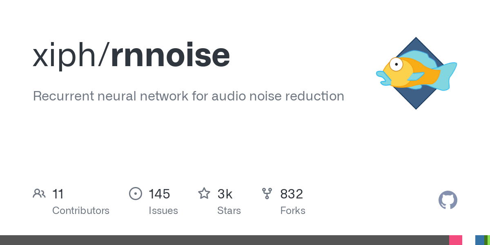

## A bit of context

The **noise suppression** works correctly in Discord, Zoom, OBS and some other specific program if you apply it.
But when you are making a recording from scratch with a specific program or in any other situation you need it, there is no noise suppression applied in real time by Windows. There is for example if you have a GIGABYTE board that applies real-time denoising, but it's pretty bad.
But, there is an open source plugin made by Werman that works very well, I would say even better than RTXVoice or similar, it doesn't require any requirements and doesn't consume any cpu or gpu resources as RTXVoice or AMD does, and it is **RNNoise**. The thing is that to apply this plugin you need an external program that is constantly running for it to work properly and this is **EqualizerAPO**.

## Installation steps:
#### 1- Download plugin and specific program:

**RNNoise**: https://github.com/werman/noise-suppression-for-voice
**EqualizerAPO**: https://sourceforge.net/projects/equalizerapo/

#### 2- Install EqualizerAPO and then:

At the end of the installation select *"Capture Devices "* and your active microphone and restart the pc.

#### 3- Open Configuration Editor from Windows

Click on +(green) below > Plugins > VST Plugins > Add RNNoise

If it gives error you have to put the plug-in in "C:\Program Files\EqualizerAPOVSTPlugins" and select it from there.

#### 4- Select at the top right your recording device and restart PC. 
Make a recording to check that it is working. The program will run every time.
>You have a **video** explaining it if it has not been very clear to you: https://www.youtube.com/watch?v=WUFDX0VfXv4